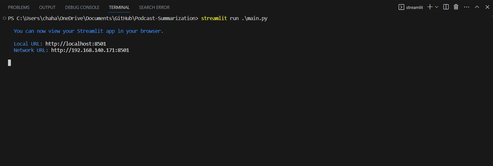
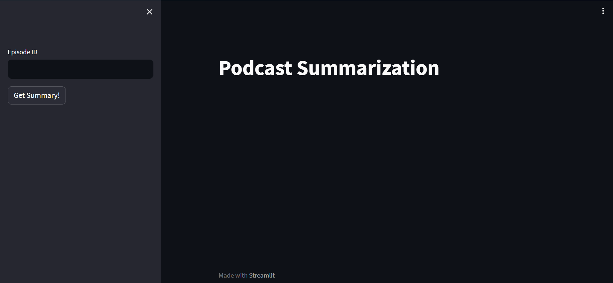
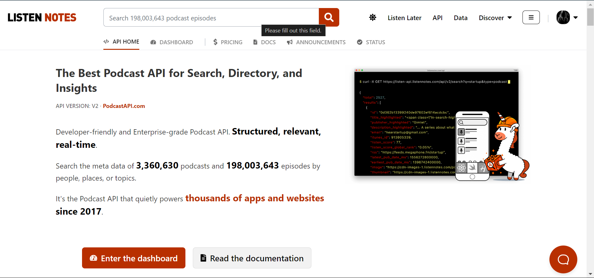
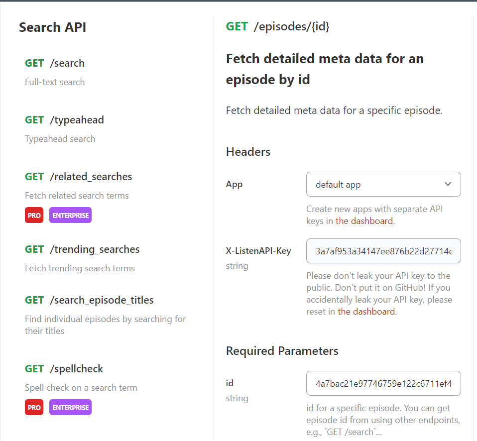
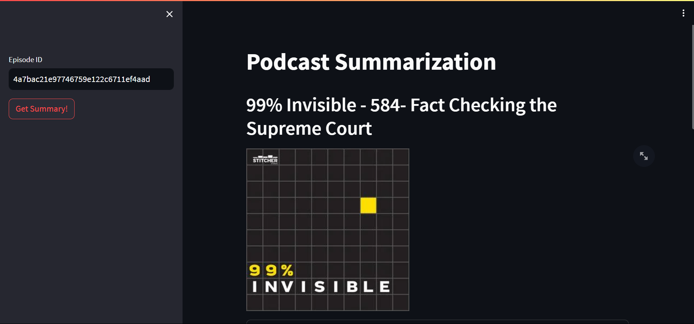
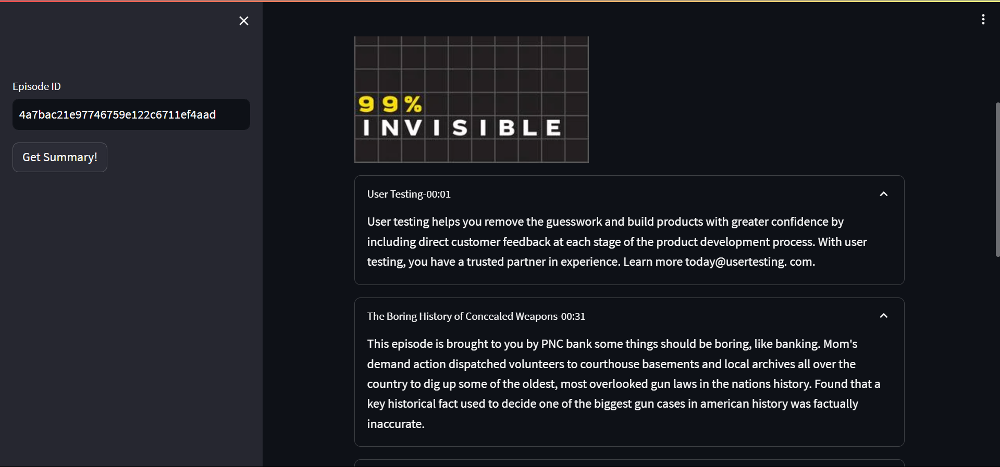
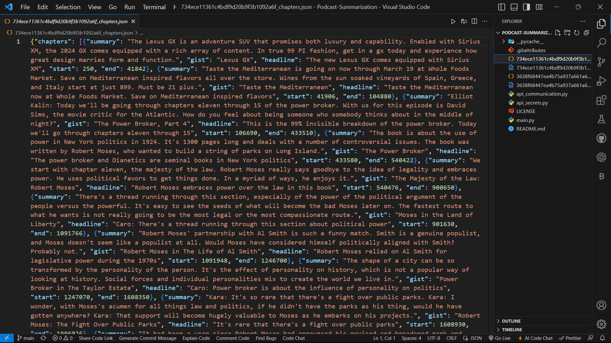
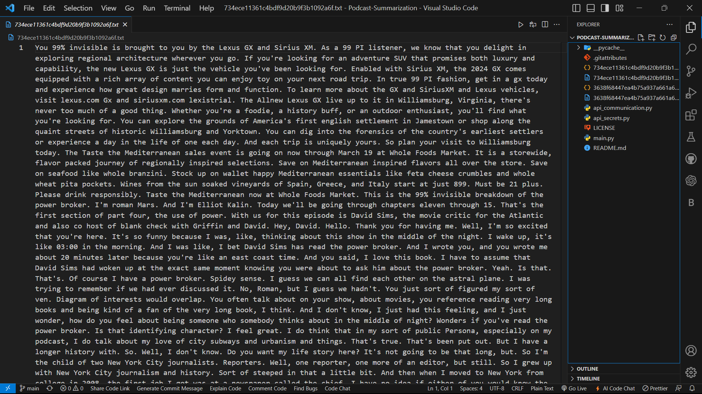

# Podcast_Summarization
 Introducing the Podcast Summarization App: effortlessly condense podcast content with our sleek interface and Listen Notes API integration. With Assembly AI, receive swift summaries and unique chapterization. Simplify podcast consumption, enhancing your listening experience in a new era of intelligent, time-saving exploration.

## Working
 This project utilizes two main files: "api_communication.py" for handling API requests and "main.py" for the Streamlit web app interface. The API communication script fetches podcast episode details from Listen Notes API, transcribes them using Assembly AI's API, and saves the summaries along with chapterization. The main.py file contains the Streamlit interface allowing users to input episode IDs and fetch summarized podcast content with chapter-wise navigation. The app simplifies podcast consumption by condensing lengthy episodes into digestible insights, enhancing the listening experience.

### Code Execution 
 To execute the code, open the project in a code editor and run the command 'streamlit run main.py'.
 

### Web App Interface
 The interface is created using Streamlit, a free, open-source Python library enabling the development of interactive web apps for data science and machine learning.
 

### Listen Notes API
 The Listen Notes API serves as a podcast search and directory tool, allowing users to search for podcasts and episodes by people, places, or topics.
 

### Fetching Episode ID
 Utilizing the Listen Notes API to retrieve the Episode ID. 
 

### Get Summary
 Use the "Get Summary" Button to obtain the episode summary via Assembly AI's API.
 

### Chapterization
 Leverage Assembly AI's API for both summarization and chapterization of the episode.
 

### JSON File
 Save the episode along with its chapterization in a JSON format.
 

### Saving Transcription
Save the episode and its transcription to a .txt file.

